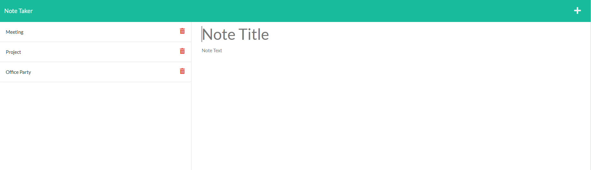

[](https://opensource.org/licenses/MIT)

# Dynamic Note Taker

## Description

This project serves as an easy to use Note Taker application. It utilizes Express.js along with node.js to dynamically create the notes on the server side. Then, the application makes fetch requests to the server side to display the notes to the user.

Any user can create notes through the deployed webpage application, the notes will be saved and persisted. When a user clicks a note, the text details will be displayed in the main note section. A user can also opt to delete a note if they're finished with it.

Deployed Application: https://dynamic-note-taker.herokuapp.com/


## Table of Contents

* [Screenshots](#screenshots)
* [Installation](#installation)
* [Usage](#usage)
* [License](#license)
* [Tests](#tests)
* [Questions](#questions)

## Screenshots

Landing Page


Saved Notes Displayed



Save A New Note


## Installation

In order to install this application, your first step would be to clone the repo onto your local machine. Once the repo is cloned to your machine, you will need to open up your terminal and navigate to the root of this project's folder. Once you're there run this command:

```
npm install
```

## Usage

In order to use this project, be sure you are at the root of the project in your terminal/git bash. Once you're there invoke this command:

```
npm start
```

Then navigate to the localhost port that is shown in your terminal through your browser. It should be "localhost:3001"

## License

Copyright 2021 Alex Sadrgilany

Permission is hereby granted, free of charge, to any person obtaining a copy 
of this software and associated documentation files (the "Software"), to deal 
in the Software without restriction, including without limitation the rights to 
use, copy, modify, merge, publish, distribute, sublicense, and/or sell copies of the 
Software, and to permit persons to whom the Software is furnished to do so, 
subject to the following conditions:

The above copyright notice and this permission notice shall be included in all 
copies or substantial portions of the Software.

THE SOFTWARE IS PROVIDED "AS IS", WITHOUT WARRANTY OF ANY KIND, EXPRESS OR IMPLIED, 
INCLUDING BUT NOT LIMITED TO THE WARRANTIES OF MERCHANTABILITY, FITNESS FOR A 
PARTICULAR PURPOSE AND NONINFRINGEMENT. IN NO EVENT SHALL THE AUTHORS OR COPYRIGHT 
HOLDERS BE LIABLE FOR ANY CLAIM, DAMAGES OR OTHER LIABILITY, WHETHER IN AN ACTION OF 
CONTRACT, TORT OR OTHERWISE, ARISING FROM, OUT OF OR IN CONNECTION WITH THE SOFTWARE 
OR THE USE OR OTHER DEALINGS IN THE SOFTWARE.

## Tests

In order to test for this project, make sure you are at the root of the project in your terminal/git bash. Once you're there run this command (after installation instructions):

```
npm test
```

## Questions

[My GitHub Profile](https://github.com/asadg7)

To reach me with questions, please email: asadrgilany7@gmail.com

